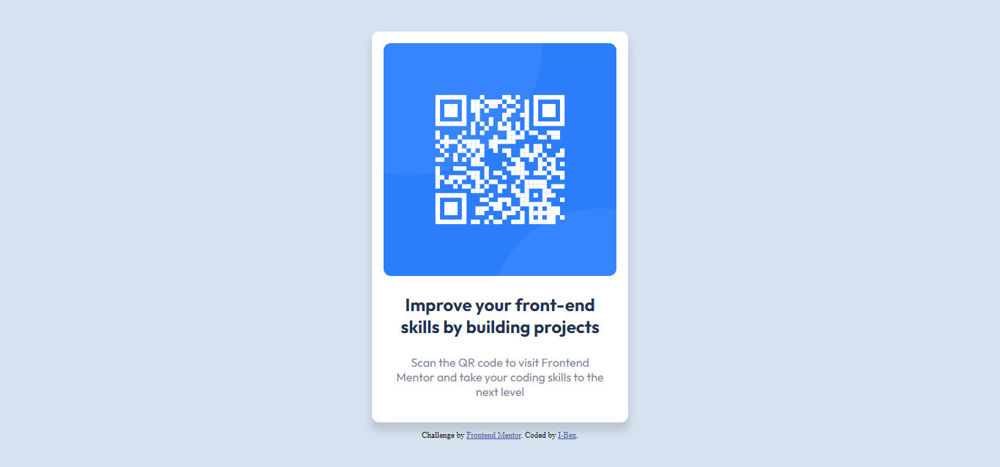

# Frontend Mentor - QR code component solution

This is a solution to the [QR code component challenge on Frontend Mentor](https://www.frontendmentor.io/challenges/qr-code-component-iux_sIO_H). Frontend Mentor challenges help you improve your coding skills by building realistic projects. 

## Table of contents

- [Overview](#overview)
  - [Screenshot](#screenshot)
  - [Links](#links)
- [My process](#my-process)
  - [Built with](#built-with)
  - [What I learned](#what-i-learned)
- [Author](#author)

## Overview

### Screenshot

### Links

- [Solution URL](https://www.frontendmentor.io/solutions/qr-code-component-solution-0fbRMG3sNn)
- [Live Site URL](https://qr-code-component-fem-challenge-01.netlify.app/)

## My process

### Built with

- Semantic HTML5 markup
- CSS custom properties
- Flexbox
- Mobile-first workflow

### What I learned

Just Practicing and Refreshing my knowledge about HTML and CSS. 

## Author

- Frontend Mentor - [@iBex](https://www.frontendmentor.io/profile/i-Bex)